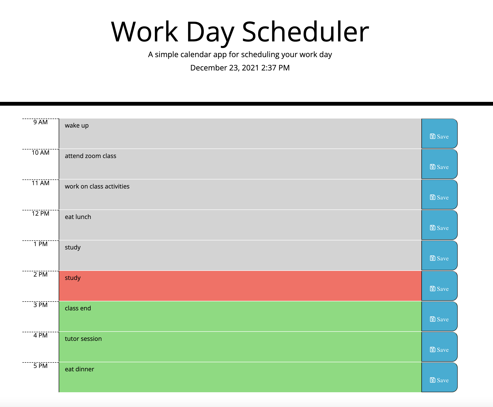

# Day Planner #
Day Planner - Jae Ahn

This is a work day scheduler application that runs in the browser and allows a user to save events for each hour of the work day (from 9 AM through 5 PM).  

At the start of the application, the user is presented with the current date and time displayed in the jumbotron at the top of the page. The date and time displayed will stay up to date on the page.  The page will also display rows of timeblocks corresponding to each hour of the work day.  The user is able to click into the text area of each timeblock and type in an event for that hour.  By clicking the save button next to the text area, the user can then save the text in that timeblock in local storage.  Events that are saved by the user will persist even after refreshing the page.

This application was created using technologies such as:
* html 
* css
* javascript
* jquery
* google fonts
* moment.js
* font awesome
* bootstrap  

Some of the methods used in creating this application were found from resources such as other classmates, W3Schools, MDN Web Docs, and Stack Overflow.

Link to Deployed Application
---------------
[Day Planner](https://ahnjaeyung.github.io/Day_Planner/)

## License
 
The MIT License (MIT)

Copyright (c) 2015 Chris Kibble

Permission is hereby granted, free of charge, to any person obtaining a copy of this software and associated documentation files (the "Software"), to deal in the Software without restriction, including without limitation the rights to use, copy, modify, merge, publish, distribute, sublicense, and/or sell copies of the Software, and to permit persons to whom the Software is furnished to do so, subject to the following conditions:

The above copyright notice and this permission notice shall be included in all copies or substantial portions of the Software.

THE SOFTWARE IS PROVIDED "AS IS", WITHOUT WARRANTY OF ANY KIND, EXPRESS OR IMPLIED, INCLUDING BUT NOT LIMITED TO THE WARRANTIES OF MERCHANTABILITY, FITNESS FOR A PARTICULAR PURPOSE AND NONINFRINGEMENT. IN NO EVENT SHALL THE AUTHORS OR COPYRIGHT HOLDERS BE LIABLE FOR ANY CLAIM, DAMAGES OR OTHER LIABILITY, WHETHER IN AN ACTION OF CONTRACT, TORT OR OTHERWISE, ARISING FROM, OUT OF OR IN CONNECTION WITH THE SOFTWARE OR THE USE OR OTHER DEALINGS IN THE SOFTWARE.
